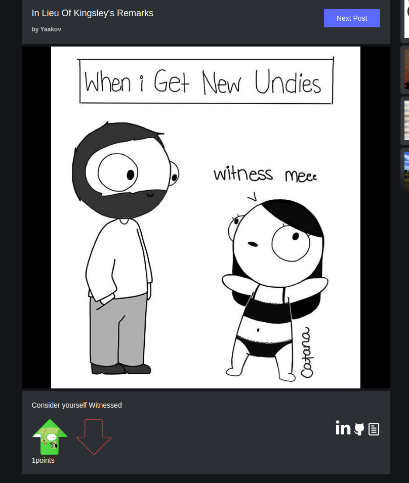
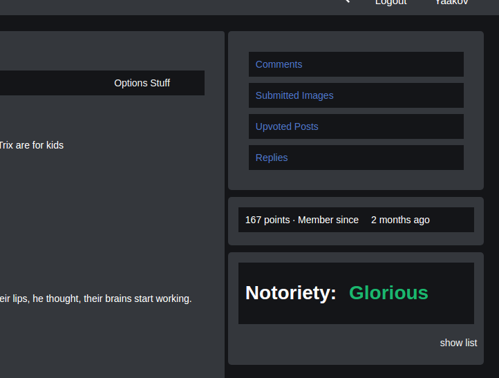

# ImGir

[ImGir live](http://imgirrrrr.herokuapp.com/#/)

ImGir is a full-stack web application clone of the popular image sharing site imgur.com. ImGir is built with Ruby on Rails for the back-end, PostgreSQL for the database, and React.js/Redux for the front-end framework.

## Features & Implementation

### User Account Creation
  Visitors will be able to navigate the entire site without ever logging in, allowing for users to share links to posts they find funny/interesting. If the visitor is so inclined however, they may create an account anytime, by hitting the signup button in the ever-present navbar. Once clicked, the visitor is presented with the signup page, which features front-end validation. After successfully creating a site, the user will be brought back to the gallery page to continue their perusing.

  

    
  

### Creating a Post
  The all-mighty omni-present navbar also contains an upload button. Clicking the button brings up a modal;

  

  
  

  if the visitor hasn't already logged in, the modal will be a sign-in page,

  

  
  

  but if they have already logged in, the upload modal is presented.
 

 
 

 From there, the user can either select image(s) or drag and drop them into the dropzone. There, they are presented with options to create a title, a description, and in the event of multiple images, select which image will be the thumbnail for the gallery. Once everything is ready to go, the user will hit the upload button, and be presented with the finalized show page.

 

 
 

### Commenting on Posts and Comments
  Every post allows user to comment on them, but also a user can comment on a comment. This abstraction allowed for the utilization of polymorphic associations. Comments can be comments of either Post, or other Comments. This has another useful benefit, when a Post is loaded, all top level comments are loaded, but that's where it ends. Instead of all the replies also being loaded, only a count is presented. If a user chooses to delve deeper, by clicking on a comment, then its replies are loaded, and so on and so forth. This works for as many level of comments as there are.

  Comment Box
  

  
  

  'A New Comment has joined the fray!!'
  

  
  

  A reply to a comment is nested, and only loaded when a user clicks the 'N-Replies'/Collapse button
  

  
  

### Votes
  'Fake Internet Points' is something thrown around a lot on imgur, and its the basis of their entire social economy. I handled this also using polymorphic association. Posts are voted on to established its points value. Likewise, every comment can also be a voted on.

  Custom Upvote/DownVote Icons
  

  
  

  This culminates to the owner of said post or comment also accumulating points on their User Page. From their, they can proudly present their status as some of the top imGir users. Bow down before them.

  

  
  

  

  
  

### Features to be implemented soon
Users will be able to view all their own posts on a user home page, along with all the comments they've made on other posts/comments. - COMPLETED

A valid view counter will be implement, logging how often an image is seen by a unique user. - COMPLETED

Search - Currently searching is handled where every keystroke in the search input queries the database. I would like to lessen the load on the db by at least hitting it
once, and perhaps deal with front end filtering. Also I would like to implement fuzzy search to handle accidentally typos, but do so in an efficient manner.

Rankings will be listed for the user with the most points accumulated from votes on posts and comments.
